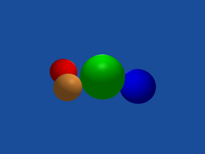

# Exploration of 3D rendering algorithms

## Description

Just a couple of experiments with 3D rendering such as raytracing in a bunch of different languages

## Dependencies

The Scala version uses play-json as its JSON library since the Scala standard library does not support JSON anymore.
Version 2.3.10 is used because higher versions depend on Java 8

## Notes about Scene format

Scenes are specified in JSON, the structure was designed so to support a clean parser structure
if possible.
